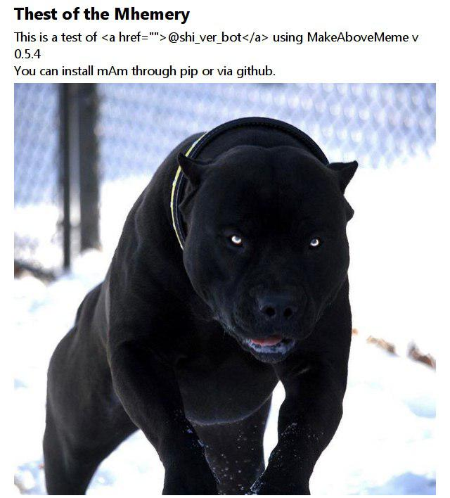

# MakeAboveMeme
An attempt to combine commandline inputs and images into a meme of simple format

And to learn how to use git submodules
## But what is it?
A command-line tool to create a meme with an image and some text above. Above that a title, below that some tags, and below them a line with "x comments, y points". Everything is optional but it looks ugly without the image.  
Here's an example made with version 0.2
```bash
python makeAboveMeme.py -T "Thest of the Mhemery" -i "https://i.imgur.com/Y3w71er.jpg" --tag "global warming" --tag "earth chan" --tag "tags are traps" --tag "What the fuck" -c "other" -p 3
```


Though I'm constantly working on that and it's thus still unstable, you can also use the telegram bot @shi_ver_bot:


As you can see, html tags are **not** evaluated. I *might* add support for links and markdown in the future, but it's not a priority.

## Installation and Dependencies
Maybe `pip install MakeAboveMeme` works. If not, make sure the following dependencies are installed and perform `git clone https://github.com/lucidBrot/MakeAboveMeme.git ./MakeAboveMeme`.

* `sudo apt-get install xvfb` or your standard x-server running
* [webkit2png](https://stackoverflow.com/a/48537053/2550406)

## Execute
`python makeAboveMeme.py -T "test title"`
`webkit2png temp.html -o meme.png -x 700 1000`

### Error Codes
If everything goes fine, the default should be 0.
If something breaks unexpectedly, the default should be 1.
If the call to webkit2png breaks, the exit code is 2.

## Formatting
Any html tags are sanitized away. You can use `\n` typed out, the newline character `\n`, or `<br>` for line breaks though.
