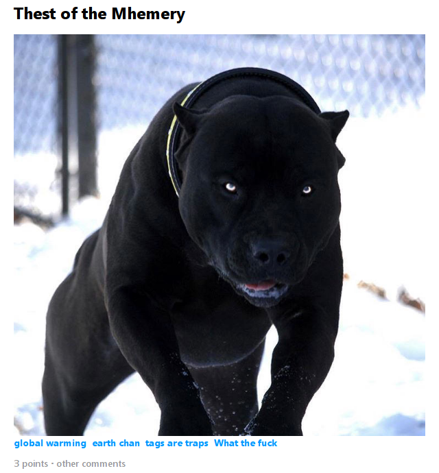

# MakeAboveMeme
An attempt to combine commandline inputs and images into a meme of simple format

And to learn how to use git submodules
## But what is it?
A command-line tool to create a meme with an image and some text above. Above that a title, below that some tags, and below them a line with "x comments, y points". Everything is optional but it looks ugly without the image.  
Here's an example made with version 0.2
```bash
python makeAboveMeme.py -T "Thest of the Mhemery" -i "https://i.imgur.com/Y3w71er.jpg" --tag "global warming" --tag "earth chan" --tag "tags are traps" --tag "What the fuck" -c "other" -p 3
```


## Dependencies
* `sudo apt-get install xvfb` or your standard x-server running
* [webkit2png](https://stackoverflow.com/a/48537053/2550406)
* `sudo apt-get install python-dev libxml2-dev libxslt1-dev zlib1g-dev`
  `pip install lxml`

## Execute
(Maybe need x-server already running. TODO: test if not)
`python makeAboveMeme.py -T "test title"`
`webkit2png temp.html -o meme.png -x 700 1000`

## Formatting
Any html tags are sanitized away. You can use `\n` typed out, the newline characeter `\n`, or `<br>` for line breaks though.
